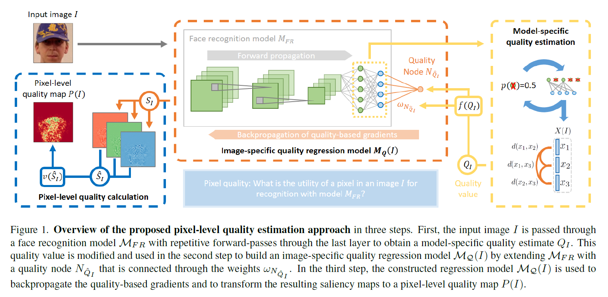

# Explainable Face Image Quality


## Pixel-Level Face Image Quality Assessment for Explainable Face Recognition

* [Research Paper](https://arxiv.org/abs/2110.11001) 
* [Implementation on ArcFace](src/XFIQ.py)


## Table of Contents 

- [Abstract](#abstract)
- [Key Points](#key-points)
- [Results](#results)
- [Installation](#installation)
- [Citing](#citing)
- [Acknowledgement](#acknowledgement)
- [License](#license)

## Abstract

An essential factor to achieve high performance in face recognition systems is the quality of its samples. Since these systems are involved in various daily life there is a strong need of making face recognition processes understandable for humans. In this work, we introduce the concept of pixel-level face image quality that determines the utility of pixels in a face image for recognition. Given an arbitrary face recognition network, in this work, we propose a training-free approach to assess the pixel-level qualities of a face image. To achieve this, a model-specific quality value of the input image is estimated and used to build a sample-specific quality regression model. Based on this model, quality-based gradients are back-propagated and converted into pixel-level quality estimates. In the experiments, we qualitatively and quantitatively investigated the meaningfulness of the pixel-level qualities based on real and artificial disturbances and by comparing the explanation maps on ICAO-incompliant faces. In all scenarios, the results demonstrate that the proposed solution produces meaningful pixel-level qualities. 



## Key Points

To summarize, the proposed Pixel-Level Quality Assessment approach 
- can be applied on arbitrary FR networks,
- does not require training, 
-  and provides a pixel-level utility description of an input face explaining how well pixels in a face image are suited for recognition (prior to any matching).

The solution can explain why an image cannot be used as a reference image during the acquisition/enrolment process and in which area of the face the subject have to do changes to increase the quality. Consequently, PLQ maps provide guidance on the reasons behind low quality images, and thus can provide interpretable instructions to improve the FIQ.


## Results

The proposed pixel-level quality estimation approach is analysed from two directions. First, low-quality face images with low-quality areas, such as occlusions, are localised and inpainted to demonstrate that this improves the face image quality. Second, random masks are placed on high-quality faces to show that the proposed methodology identifies these as low-quality areas. Both evaluation approaches, enhancing low-quality images and degrading high-quality images,
aim at quantitatively (via quality-changes) and qualitatively (via changes in the PLQ-maps) investigating the effectiveness of the proposed PLQA approach. Lastly, the
PLQ-maps are investigated on ICAO-incompliant faces.

In the following, we will focus on some qualitative results. For more details and quanitative results, please take a look at the paper.


**PLQ explanation maps before and after inpainting** - Images before and after the inpainting process are shown with their
corresponding PLQ-maps and FIQ values. The images show the effect of small and large occlusions, glasses, headgears, and beards on the
PLQ-maps for two FR models. In general, these are identified as areas of low pixel-quality and inpainting these areas strongly increases
the pixel-qualities of these areas as well as the FIQ. This demonstrates that our solution leads to reasonable pixel-level quality estimates
and thus can give interpretable recommendations on the causes of low quality estimates.

 

**PLQ-explanation maps for random masks** - For two random identities, their masked and unmasked images are shown with
their corresponding PLQ-maps. In general, the effect of the mask on the PLQ-map is clearly visible demonstrating the effectiveness of the
proposed approach to detect disturbances.

 

**PLQ-explanation maps for ICAO imcompliant images** - One ICAO-compliant image and twelve images with imcompliances
are shown with their corresponding PLQ-maps. Occlusions (b,c,d), distorted areas of the face (f), and reflections result in low-pixel
qualities.

 


## Installation
Python 3.7 or 3.8 is recommended. Requires opencv-python>=4.5.2.52, Tensorflow>=2.3.0, numpy>=1.20.3, sklearn>=0.24.2, matplotlib>=3.4.2 and tqdm>=4.60.0.

Download the [weights-file](https://drive.google.com/file/d/1pOB0MUg6hkyVF6VNzjTbJ_k3X1_hXyG4/view?usp=sharing) and place it in the src-folder. 
The Keras-based ArcFace model is then created during the first execution. Create 
```
src/gradients 
```
directory for the gradients and 

```
src/plots 
```
directory for the PLQ-maps.

To run the code, use the *XFIQ.py* file in the src-folder: 

```
python XFIQ.py
```

All parameters can be adjusted there. The script takes all images from a folder and saves the raw gradients as well 
as the explanation maps, inluding the quality values. 

The images need to be preprocessed (cropped, aligned). The proprocessing can be done using the 
*setup_img(img)* method in *preprocessing.py*. The preprocessing script requires skimage>=0.18.1 and MTCNN>=0.1.0
to be installed. 


## Related works

- IJCB 2023: Explaining Face Recognition Through SHAP-Based Pixel-Level Face Image Quality Assessment
- EUSIPCO 2022: On Evaluating Pixel-Level Face Image Quality Assessment


## Citing

If you use this code, please cite the following paper.


```
@article{DBLP:journals/corr/abs-2110-11001,
  author    = {Philipp Terh{\"{o}}rst and
               Marco Huber and
               Naser Damer and
               Florian Kirchbuchner and
               Kiran Raja and
               Arjan Kuijper},
  title     = {Pixel-Level Face Image Quality Assessment for Explainable Face Recognition},
  journal   = {CoRR},
  volume    = {abs/2110.11001},
  year      = {2021},
  url       = {https://arxiv.org/abs/2110.11001},
  eprinttype = {arXiv},
  eprint    = {2110.11001},
  timestamp = {Thu, 28 Oct 2021 15:25:31 +0200},
  biburl    = {https://dblp.org/rec/journals/corr/abs-2110-11001.bib},
  bibsource = {dblp computer science bibliography, https://dblp.org}
}
```

If you make use of our implementation based on ArcFace, please additionally cite the original .

## Acknowledgement

This research work has been funded by the German Federal Ministry of Education and Research and the Hessen State Ministry for Higher Education, Research and the Arts within their joint support of the National Research Center for Applied Cybersecurity ATHENE.
Portions of the research in this paper use the FERET database of facial images collected under the FERET program, sponsored by the DOD Counterdrug Technology Development Program Office.
This work was carried out during the tenure of an ERCIM ’Alain Bensoussan‘ Fellowship Programme.

## License 

This project is licensed under the terms of the Attribution-NonCommercial 4.0 International (CC BY-NC 4.0) license.
Copyright (c) 2021 Fraunhofer Institute for Computer Graphics Research IGD Darmstadt

